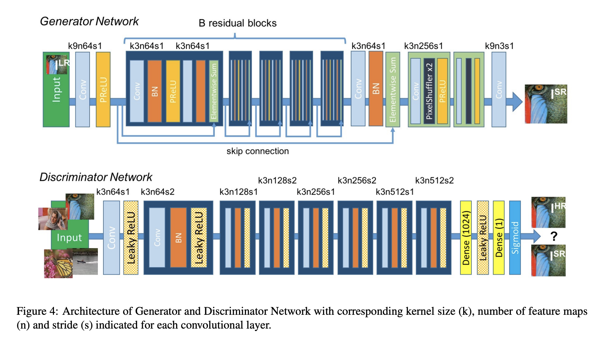
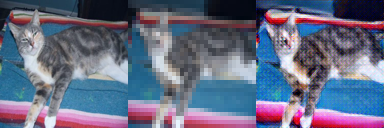
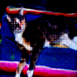
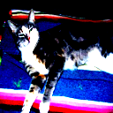
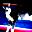
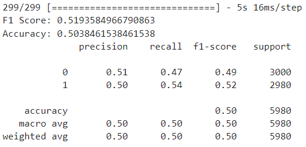
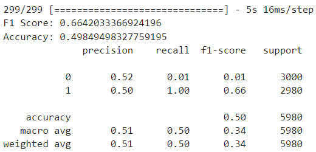

# Applied-AI SRGAN Midterm Project
## Intro & Requirement 
> The Midterm exam will be based on building a Generative Adversarial Network (GAN) and using it to generate high-resolution images for the binary classification problem you have already implemented in Assignment 1.

[Super Resolution GAN (SRGAN)](https://arxiv.org/pdf/1609.04802.pdf) is a deep learning architecture that uses a combination of GANs and convolutional neural networks (CNNs) to generate high-resolution images from low-resolution images. The idea behind SRGAN is to train a generator network to create high-resolution images that are as close as possible to the real high-resolution images, and a discriminator network that is trained to distinguish between the generated high-resolution images and real high-resolution images. The training process involves feeding low-resolution images to the generator, which then generates a high-resolution image. The discriminator then evaluates the generated high-resolution image and provides feedback to the generator to improve the quality of the generated image. The generator and discriminator networks are trained iteratively until the generated images are of sufficient quality. Super Resolution GAN has many practical applications, such as in medical imaging, satellite imagery, and video processing. It can help to enhance the quality of low-resolution images, making them more useful for analysis and decision-making.

## Content
- SRGAN: Super Resolution GAN
- Model A: was trained on [cats vs dogs](https://www.kaggle.com/datasets/shaunthesheep/microsoft-catsvsdogs-dataset/data) datasets.
- Model B: was trained on the same dataset above, but the car dataset was replaced with generated results from SRGAN.

----
- [x] Notebook (*ipynb*) files content of all the code for training and getting metric results
- [x] html file was converted from notebook files for better visualization
- [x] compare the performance of both models using different metrics such as F1, Accuracy, AUC

## Results

SRGAN result:
- left image (128x128) input of discriminator network
- middle image (32x32) input of generator network
- right image is the result of super super-resolution

SRGAN Super-Resolution image

128x128 High-Resolution image

32x32 Low-resolution image

-----

Model A's F1 Score and Accuracy results

Model B's F1 Score and Accuracy results
